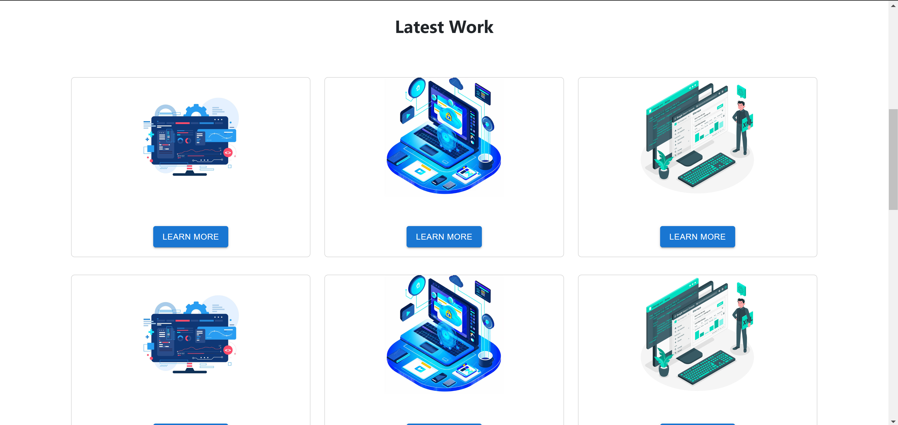
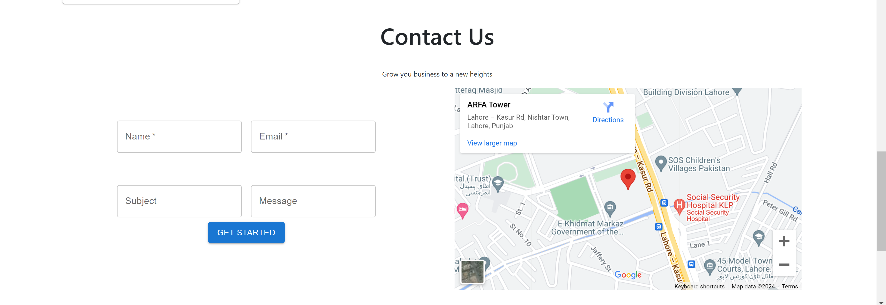
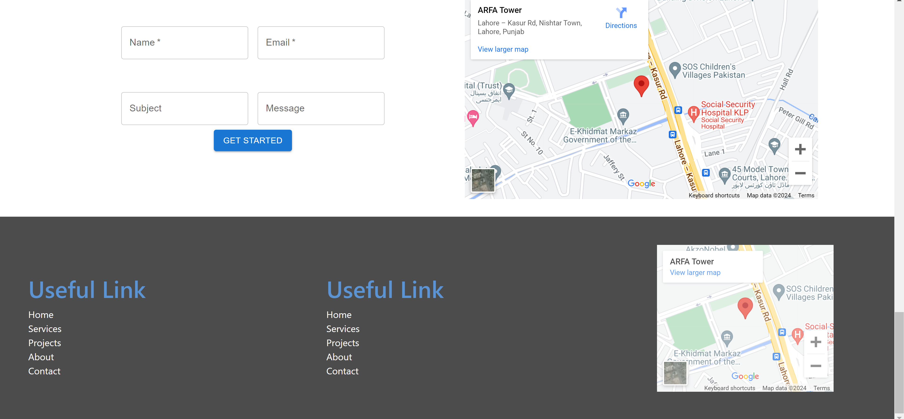

# React Portfolio

Brief description of what this project does and who it's for.

## Getting Started with Create React App

This project was booted with [Create React App](https://github.com/facebook/create-react-app), a comfortable environment for learning React, and is the best way to start building a new single-page application in React.

### Prerequisites

Before you begin, ensure you have met the following requirements:

- Node.js version 10.16.0 or later
- npm version 5.6 or later

You can check your node and npm version by running `node -v` and `npm -v` in your terminal.

### Installation

To install the project, follow these steps:

1. Clone the repository:
   ```bash
   `git clone https://github.com/MianAliKhalid/portfolio-react`
   ```
2. Navigate to the project directory:
   ```bash
   `cd portfolio-react`
   ```
3. Install dependencies:
   ```bash
   `npm install`
   ```

### Available Scripts

In the project directory, you can run:

#### `npm start`

Runs the app in the development mode. Open [http://localhost:3000](http://localhost:3000) to view it in your browser. The page will reload when you make changes. You may also see any lint errors in the console.

#### `npm test`

Launches the test runner in the interactive watch mode. See the section about [running tests](https://facebook.github.io/create-react-app/docs/running-tests) for more information.

#### `npm run build`

Builds the app for production to the `build` folder. It correctly bundles React in production mode and optimizes the build for the best performance.

### Contributing

We welcome contributions! Please see our `CONTRIBUTING.md` for how to get started.

### License

This project is licensed under the [MIT License](LICENSE.md) - see the LICENSE file for details.

### Acknowledgments

- Hat tip to anyone whose code was used
- Inspiration
- etc

### Contact

If you want to contact me you can reach me at `mianalikhalid2000@gmail.com`.
```


### Portfolio Screenshot
```





```

